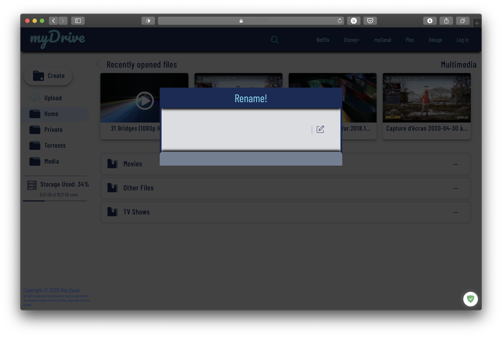
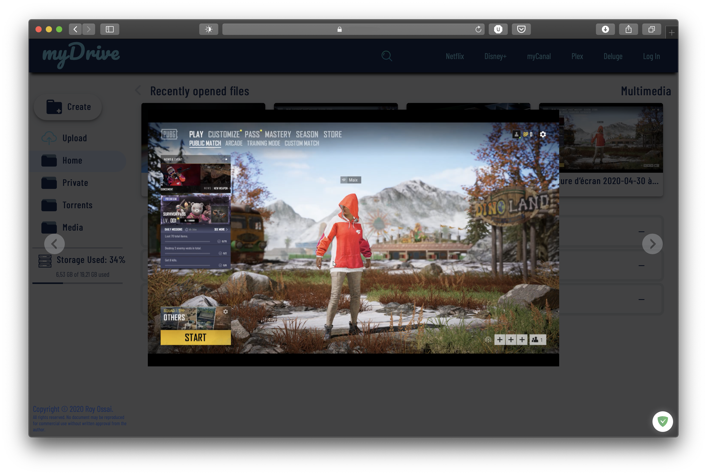

# Cloud-Drive
A personal cloud website built with CSS, PHP, JQuery and vanilla Javascript

This project was somthing i built to pass the time during the quarantine. This is a welcome alternative to the default apache file system interface.

This website has some basic security features.
* Instead of having a url (eg "?url=/path/to/file") to the absolute path of file of folder shown, Every reference to file or folders are replaced with randomnly generated 13 character strings ("?url=haien347qio4nd72"). This therefore means your items can not be easily located for download or maybe modification 
* Certain sensitive actions require authentication to continue, for example you need to autheticate to delete, move or rename files or folders.
* A scope can be set. This scope is a directory and everything in this folder, ie. subfolders and files, in accordance with item 2 above, are made available to everyone that has your domain name but anything outside this scope also requires authentication

The website's elements are all dynamic loaded and this brings with it some extra added features.
* You can initiate an upload (by either drag and drop or by clicking on the upload button) and still be able to navigate through other folders or view files without affecting the upload  
* CSS and JS files are only ever downloaded once clientside reducing bandwidth

### The main features of the website
* You can delete both files and folders 
* You can move both files and folders from anywhere in/outside the scope of the website (within the scope of the server) 
* You can rename both files and folders 
* You can share both files and folders all with their 13 characterer generated string ("domain.name/share.php?url=haien347qio4nd72")
* You can search for every file and folder within the search scope -- see index.php 
* You can Create folders anwhere php has write access to
* The recent tab allows you access to the 4 last viewed files 
* You can stream "webm, mkv, mp4 and m4v" files, all depending on the strength of your server 
* You can view images in modals, and pdf files without downloding. 
* You can download folders as zip files "note that this zip file isn't deleted and is stored in /home/temp/"
* You also have access to storage space used not by the website but in general, on your server.
* The website shares notifications when tasks failed , succeded  or require attention 
* The media button allows you to search for all streamable video in one go. 

## Some more images
 

Note: This website requires a working install of ffmpeg to work properly
